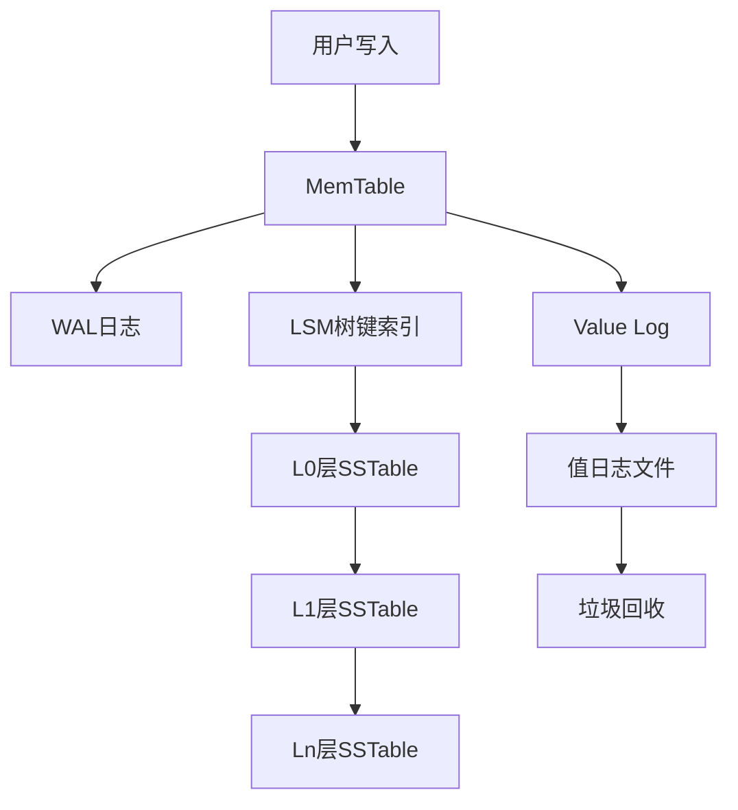

# 核心存储架构

Badger采用基于LSM树（Log-Structured Merge Tree）的存储架构，但与传统LSM树不同的是，它实现了键值分离设计。

## LSM树实现

### 数据结构组成

#### 1. MemTable（内存表）

位置：`memtable.go:34-41`

```go
type memTable struct {
    sl         *skl.Skiplist  // 跳表实现
    wal        *logFile       // 写前日志
    maxVersion uint64         // 最大版本号
    opt        Options
    buf        *bytes.Buffer
}
```

- **跳表（Skiplist）**: 使用`skl/skl.go`中实现的跳表作为内存中的有序数据结构
- **WAL机制**: 每个memtable都有对应的WAL文件，确保崩溃恢复能力
- **版本控制**: 通过maxVersion跟踪最新的时间戳版本

#### 2. SSTable（磁盘表）

位置：`table/table.go:86-109`

```go
type Table struct {
    sync.Mutex
    *z.MmapFile
    tableSize int
    _index *fb.TableIndex    // FlatBuffers索引
    _cheap *cheapIndex       // 轻量级索引
    ref    atomic.Int32      // 引用计数
    smallest, biggest []byte // 最小最大键
    id                uint64 // 文件ID
    // ... 其他字段
}
```

## 数据流转路径

### 写入路径分析

#### 1. 写入MemTable

位置：`memtable.go:170-199`

```go
func (mt *memTable) Put(key []byte, value y.ValueStruct) error {
    // 1. 构造Entry
    entry := &Entry{
        Key:       key,
        Value:     value.Value,
        UserMeta:  value.UserMeta,
        meta:      value.Meta,
        ExpiresAt: value.ExpiresAt,
    }
    
    // 2. 写入WAL（如果不是内存模式）
    if mt.wal != nil {
        if err := mt.wal.writeEntry(mt.buf, entry, mt.opt); err != nil {
            return y.Wrapf(err, "cannot write entry to WAL file")
        }
    }
    
    // 3. 写入跳表并更新版本
    mt.sl.Put(key, value)
    if ts := y.ParseTs(entry.Key); ts > mt.maxVersion {
        mt.maxVersion = ts
    }
    return nil
}
```

#### 2. MemTable刷盘

位置：`db.go:1095-1128`

```go
func (db *DB) flushMemtable(lc *z.Closer) {
    defer lc.Done()
    
    for mt := range db.flushChan {
        if mt == nil {
            continue
        }
        
        for {
            if err := db.handleMemTableFlush(mt, nil); err != nil {
                // 重试机制
                db.opt.Errorf("error flushing memtable to disk: %v, retrying", err)
                time.Sleep(time.Second)
                continue
            }
            
            // 更新immutable memtable列表
            db.lock.Lock()
            y.AssertTrue(mt == db.imm[0])
            db.imm = db.imm[1:]
            mt.DecrRef() // 释放内存
            db.lock.Unlock()
            break
        }
    }
}
```

## 分层存储设计

### Level结构

位置：`levels.go:32-41`

```go
type levelsController struct {
    nextFileID atomic.Uint64
    l0stallsMs atomic.Int64
    levels []*levelHandler  // 多层级处理器
    kv     *DB
    cstatus compactStatus   // 压缩状态
}
```

### 分层特性

#### L0层特性
- **直接刷盘**：直接从MemTable刷盘而来，无需重组键范围
- **文件重叠**：同层文件的键范围可能重叠，因为它们来自不同时间的MemTable
- **时间排序**：按文件创建时间排序，而非键值排序
- **读取复杂度**：需要检查所有L0文件，读取复杂度为O(n)

#### L1-Ln层特性
- **压缩维护**：通过后台压缩操作维护层级结构
- **无重叠有序**：同层文件键范围完全不重叠，按键值有序排列
- **二分查找**：支持O(log n)复杂度的文件定位
- **范围查询友好**：连续键范围映射到连续文件

## WiscKey键值分离架构

Badger基于WiscKey论文实现了键值分离设计：

### 架构优势

1. **键存储在LSM树中**：保持有序性，支持范围查询
2. **值存储在独立的值日志中**：减少写放大，提高写入性能
3. **垃圾回收机制**：定期清理无效的值日志文件

### 实现细节



这种设计有效减少了写放大问题，特别适合写密集型应用场景。

## 存储格式

### SSTable格式

每个SSTable文件包含：
- **数据块**：存储键值对数据
- **索引块**：提供快速键查找
- **布隆过滤器**：减少不必要的磁盘IO
- **元数据**：文件统计信息

### Value Log格式

Value Log采用追加写入的方式：
- **Header**：包含魔数和版本信息
- **Entry**：键值对条目
- **Checksum**：数据完整性校验

通过这种分离设计，Badger在保持LSM树优势的同时，显著提升了写入性能。