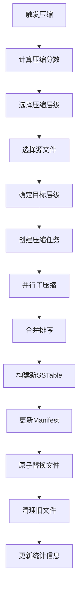

# 关键组件解析

Badger数据库包含多个关键组件，每个组件都有其特定的功能和优化策略。本章节详细分析这些核心组件的实现原理和作用。

## 索引结构实现

### 1. 布隆过滤器

位置：`y/bloom.go:9-10`

```go
type Filter []byte
```

**布隆过滤器实现**：

```go
func (f Filter) MayContain(key []byte) bool {
    if len(f) < 2 {
        return false
    }
    k := f[len(f)-1]
    if k > 30 {
        return true
    }
    nBits := uint32(8 * (len(f) - 1))
    delta := (uint32(xxhash.Sum64(key)) >> 17) | (uint32(xxhash.Sum64(key)) << 15)
    h := uint32(xxhash.Sum64(key))
    for i := uint8(0); i < k; i++ {
        bitPos := h % nBits
        if f[bitPos/8]&(1<<(bitPos%8)) == 0 {
            return false
        }
        h += delta
    }
    return true
}
```

**布隆过滤器特性**：
- **快速判断**：O(k)时间复杂度判断键是否可能存在
- **空间效率**：使用位数组，内存占用小
- **误判控制**：只有假阳性，没有假阴性
- **哈希函数**：使用xxhash实现高性能哈希

**应用场景**：
- **减少磁盘IO**：快速过滤不存在的键
- **SSTable查找优化**：避免读取不包含目标键的文件
- **缓存命中率提升**：减少无效的缓存查找

### 2. FlatBuffers索引

使用FlatBuffers序列化格式，位置：`table/table.go:93`

```go
_index *fb.TableIndex // Nil if encryption is enabled
```

**FlatBuffers优势**：
- **零拷贝访问**：直接从内存映射文件读取
- **高效序列化**：无需反序列化即可访问数据
- **跨平台兼容**：标准化的二进制格式
- **内存对齐**：优化CPU缓存性能

**索引结构**：

```go
type TableIndex struct {
    Offsets    []uint32  // 块偏移量数组
    BloomFilter []byte   // 布隆过滤器数据
    MaxVersion uint64    // 最大版本号
    KeyCount   uint32    // 键数量
    UncompressedSize uint32 // 未压缩大小
    OnDiskSize uint32    // 磁盘大小
}
```

### 3. 跳表索引

MemTable使用跳表作为内存索引，位置：`skl/skl.go`

```go
type Skiplist struct {
    height     int32    // 当前最大高度
    headOffset uint32   // 头节点偏移
    ref        int32    // 引用计数
    arena      *Arena   // 内存分配器
}
```

**跳表特性**：
- **有序性**：维护键的有序排列
- **并发安全**：支持无锁并发读写
- **性能稳定**：平均O(log n)的查找复杂度
- **内存效率**：使用Arena分配器减少碎片

**跳表操作**：

```go
func (s *Skiplist) Put(key []byte, v y.ValueStruct) {
    // 查找插入位置
    listHeight := s.getHeight()
    var prev [maxHeight]uint32
    var next [maxHeight]uint32
    prev[listHeight] = s.headOffset
    
    // 从最高层开始查找
    for i := int(listHeight) - 1; i >= 0; i-- {
        prev[i], next[i] = s.findSpliceForLevel(key, prev[i+1], i)
    }
    
    // 插入新节点
    height := s.randomHeight()
    x := newNode(s.arena, key, v, height)
    
    // 更新指针
    for i := 0; i < int(height); i++ {
        x.tower[i] = next[i]
        s.getNode(prev[i]).tower[i] = x.offset
    }
}
```

## Compaction过程分析

### 1. 触发条件

基于分数计算的压缩优先级，位置：`levels.go:524-530`

```go
type compactionPriority struct {
    level        int
    score        float64      // 压缩分数
    adjusted     float64      // 调整后分数
    dropPrefixes [][]byte     // 需要删除的前缀
    t            targets      // 压缩目标
}
```

**分数计算逻辑**：

```go
func (s *levelsController) pickCompactLevels() (prios []compactionPriority) {
    // 计算每层的压缩分数
    for i, l := range s.levels {
        // L0层特殊处理
        if i == 0 {
            // 基于文件数量计算
            if len(l.tables) >= s.kv.opt.NumLevelZeroTables {
                pri := compactionPriority{
                    level: i,
                    score: float64(len(l.tables)) / float64(s.kv.opt.NumLevelZeroTables),
                }
                prios = append(prios, pri)
            }
        } else {
            // 其他层基于大小计算
            if l.getTotalSize() >= l.maxTotalSize {
                pri := compactionPriority{
                    level: i,
                    score: float64(l.getTotalSize()) / float64(l.maxTotalSize),
                }
                prios = append(prios, pri)
            }
        }
    }
    
    // 按分数排序
    sort.Slice(prios, func(i, j int) bool {
        return prios[i].score > prios[j].score
    })
    
    return prios
}
```

### 2. 执行逻辑

压缩过程的详细流程：



**子压缩实现**，位置：`levels.go:631-865`

```go
func (s *levelsController) subcompact(it y.Iterator, kr keyRange, cd compactDef,
    inflightBuilders *y.Throttle, res chan<- *table.Table) {
    
    // 检查重叠情况
    hasOverlap := s.checkOverlap(cd.allTables(), cd.nextLevel.level+1)
    
    // 选择丢弃时间戳
    discardTs := s.kv.orc.discardAtOrBelow()
    
    var numBuilds, numVersions int
    var lastKey, skipKey []byte
    
    // 构建新表
    addKeys := func(builder *table.Builder) {
        timeStart := time.Now()
        var numKeys, numSkips uint64
        
        for ; it.Valid(); it.Next() {
            // 处理键值对
            key := it.Key()
            vs := it.Value()
            
            // 检查是否需要跳过
            if len(cd.dropPrefixes) > 0 && hasAnyPrefixes(key, cd.dropPrefixes) {
                numSkips++
                continue
            }
            
            // 版本控制和过期处理
            version := y.ParseTs(key)
            isDeletedOrExpired := isDeletedOrExpired(vs.Meta, vs.ExpiresAt)
            
            if version <= discardTs {
                if isDeletedOrExpired {
                    // 跳过已删除或过期的旧版本
                    numSkips++
                    continue
                }
                
                // 版本数量控制
                if !y.SameKey(key, lastKey) {
                    numVersions = 0
                    lastKey = y.SafeCopy(lastKey, key)
                }
                numVersions++
                
                if numVersions == s.kv.opt.NumVersionsToKeep {
                    skipKey = y.SafeCopy(skipKey, key)
                }
                if bytes.Equal(key[:len(key)-8], skipKey) {
                    numSkips++
                    continue
                }
            }
            
            // 添加到新表
            vs.Version = version
            builder.Add(key, vs, vp.Len)
            numKeys++
        }
        
        s.kv.opt.Infof("LOG Compact. Added %d keys. Skipped %d keys. Iteration took: %v",
            numKeys, numSkips, time.Since(timeStart))
    }
    
    // 创建表构建器
    if inflightBuilders != nil {
        inflightBuilders.Start()
        defer inflightBuilders.Done(nil)
    }
    
    builder := table.NewTableBuilder(s.kv.opt)
    defer builder.Close()
    
    // 添加键值对
    addKeys(builder)
    
    // 构建表
    newTable, err := table.CreateTable(fname, builder)
    if err != nil {
        res <- nil
        return
    }
    
    res <- newTable
}
```

### 3. 压缩策略优化

**分层压缩策略**：
- **L0→L1**：多路归并，处理重叠文件
- **L1→L2**：范围压缩，保持有序性
- **L2→Ln**：增量压缩，减少写放大

**并发控制**：
- **子压缩并行**：将大压缩任务分解为多个子任务
- **资源限制**：控制同时进行的压缩数量
- **优先级调度**：高分数层级优先处理

## Value Log管理

### 1. Value Log结构

```go
type valueLog struct {
    buf        *bytes.Buffer
    dirPath    string
    elog       trace.EventLog
    filesToDelete []uint32
    
    // Value log files.
    filesMap map[uint32]*logFile
    filesLock sync.RWMutex
    maxFid   uint32
    
    // Garbage collection
    garbageCh      chan struct{}
    lfDiscardStats *lfDiscardStats
}
```

**Value Log特性**：
- **顺序写入**：所有值按顺序追加写入
- **垃圾回收**：定期清理无效数据
- **文件轮转**：达到大小限制时创建新文件
- **并发安全**：支持并发读写操作

### 2. 垃圾回收机制

```go
func (vlog *valueLog) runGC(discardRatio float64) error {
    select {
    case vlog.garbageCh <- struct{}{}:
        // 获取GC权限
    default:
        return ErrNoRewrite
    }
    defer func() {
        <-vlog.garbageCh
    }()
    
    // 选择需要GC的文件
    lf := vlog.pickLog(discardRatio)
    if lf == nil {
        return ErrNoRewrite
    }
    
    // 执行GC
    return vlog.doRunGC(lf)
}
```

**GC策略**：
- **基于比例**：当无效数据比例超过阈值时触发
- **文件选择**：优先选择无效数据最多的文件
- **重写机制**：将有效数据写入新文件
- **原子替换**：确保GC过程的一致性

### 3. 读取优化

```go
func (vlog *valueLog) read(vp valuePointer, s *y.Slice) ([]byte, func(), error) {
    // 获取文件句柄
    lf, err := vlog.getFile(vp.Fid)
    if err != nil {
        return nil, nil, err
    }
    
    // 读取数据
    buf, cb, err := lf.read(vp, s)
    if err != nil {
        return nil, nil, err
    }
    
    return buf, cb, nil
}
```

**读取优化策略**：
- **文件缓存**：缓存常用的Value Log文件句柄
- **预读机制**：批量读取减少系统调用
- **内存映射**：使用mmap提高读取性能
- **并发读取**：支持多个goroutine并发读取

## 内存管理组件

### 1. Arena分配器

```go
type Arena struct {
    n          uint32    // 当前偏移量
    shouldGrow bool      // 是否需要扩容
    buf        []byte    // 内存缓冲区
}
```

**Arena特性**：
- **批量分配**：一次性分配大块内存
- **快速分配**：O(1)时间复杂度
- **内存对齐**：确保数据结构对齐
- **统一释放**：整个Arena一次性释放

### 2. 引用计数管理

```go
type refCount struct {
    count int32
    closer *z.Closer
}

func (r *refCount) Increment() int32 {
    return atomic.AddInt32(&r.count, 1)
}

func (r *refCount) Decrement() int32 {
    newCount := atomic.AddInt32(&r.count, -1)
    if newCount == 0 && r.closer != nil {
        r.closer.SignalAndWait()
    }
    return newCount
}
```

**引用计数应用**：
- **表文件管理**：控制SSTable文件的生命周期
- **MemTable管理**：确保MemTable在使用时不被释放
- **迭代器管理**：防止迭代器使用过程中数据被清理

### 3. 缓存管理

使用Ristretto缓存库实现高效缓存：

```go
// 块缓存配置
blockCache, err := ristretto.NewCache(&ristretto.Config[[]byte, *Block]{
    NumCounters: 1e7,     // 计数器数量
    MaxCost:     1 << 30, // 最大成本（1GB）
    BufferItems: 64,      // 缓冲区大小
})

// 索引缓存配置
indexCache, err := ristretto.NewCache(&ristretto.Config[uint64, *fb.TableIndex]{
    NumCounters: 1e6,     // 计数器数量
    MaxCost:     1 << 28, // 最大成本（256MB）
    BufferItems: 64,      // 缓冲区大小
})
```

**缓存策略**：
- **LFU淘汰**：基于访问频率的智能淘汰
- **成本控制**：基于内存使用量的精确控制
- **并发安全**：支持高并发访问
- **统计信息**：提供详细的缓存统计

通过这些关键组件的协同工作，Badger实现了高性能、高可靠性的键值存储功能。每个组件都经过精心设计和优化，确保在各种工作负载下都能提供优秀的性能表现。