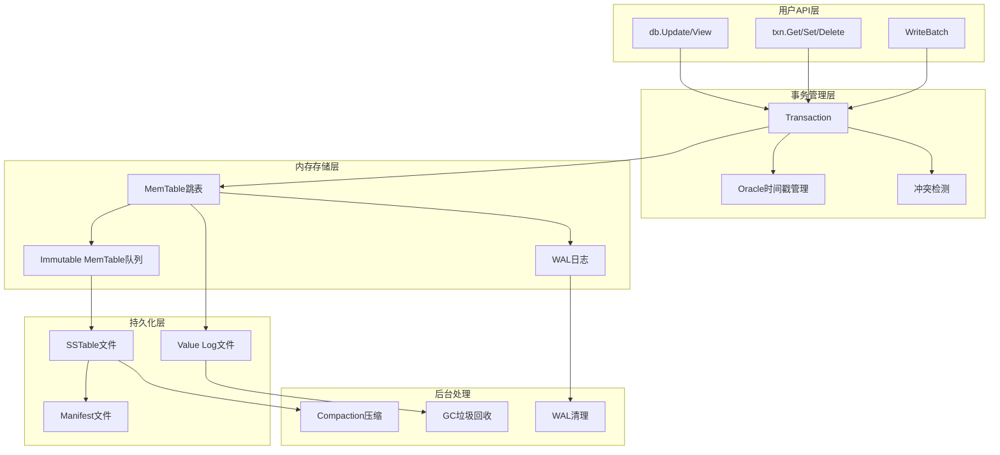
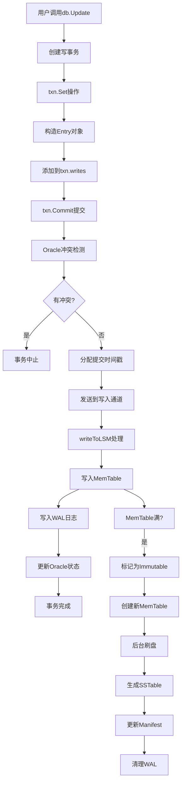
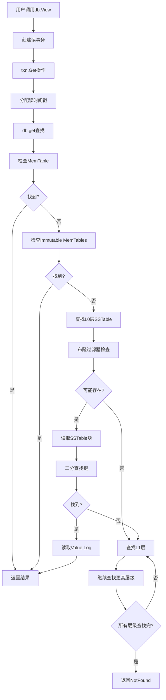
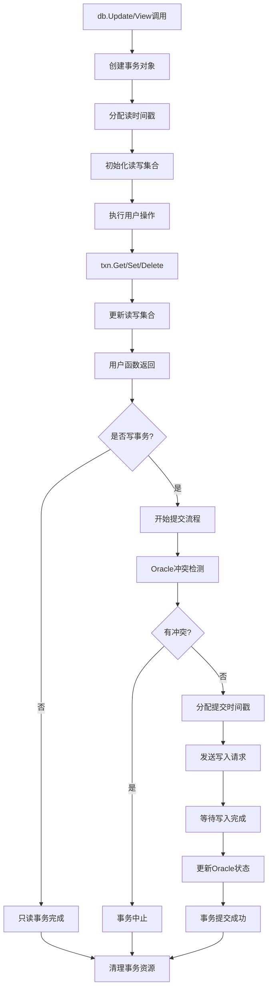
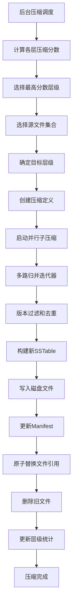
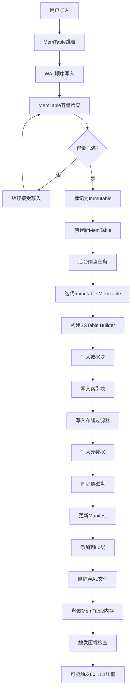

# 完整数据流分析

本章节详细分析Badger数据库从API入口到底层存储的完整数据流转过程，帮助理解整个系统的工作机制。

## 系统架构概览



## 写入操作完整流程

### 1. API入口分析

用户通过以下API进行写入操作：

```go
// 事务写入
err := db.Update(func(txn *badger.Txn) error {
    return txn.Set([]byte("key"), []byte("value"))
})

// 批量写入
wb := db.NewWriteBatch()
defer wb.Cancel()
wb.Set([]byte("key1"), []byte("value1"))
wb.Set([]byte("key2"), []byte("value2"))
return wb.Flush()
```

### 2. 写入流程图



### 3. 关键函数调用链

#### txn.Set() 实现

位置：`txn.go:489-503`

```go
func (txn *Txn) Set(key, val []byte) error {
    return txn.SetEntry(NewEntry(key, val))
}

func (txn *Txn) SetEntry(e *Entry) error {
    return txn.modify(e)
}

func (txn *Txn) modify(e *Entry) error {
    const maxKeySize = 65000
    
    switch {
    case !txn.update:
        return ErrReadOnlyTxn
    case txn.discarded:
        return ErrDiscardedTxn
    case len(e.Key) == 0:
        return ErrEmptyKey
    case bytes.HasPrefix(e.Key, badgerPrefix):
        return ErrInvalidKey
    case len(e.Key) > maxKeySize:
        return exceedsSize("Key", maxKeySize, e.Key)
    case int64(len(e.Value)) > txn.db.opt.ValueLogFileSize:
        return exceedsSize("Value", txn.db.opt.ValueLogFileSize, e.Value)
    }
    
    if err := txn.checkSize(e); err != nil {
        return err
    }
    
    // 添加到写集合
    txn.writes = append(txn.writes, e)
    return nil
}
```

#### txn.Commit() 实现

位置：`txn.go:405-442`

```go
func (txn *Txn) Commit() error {
    // 检查事务状态
    if txn.discarded {
        return ErrDiscardedTxn
    }
    defer txn.Discard()
    
    if len(txn.writes) == 0 {
        return nil // 只读事务直接返回
    }
    
    txnCb, err := txn.commitAndSend()
    if err != nil {
        return err
    }
    
    // 等待提交完成
    return txnCb()
}

func (txn *Txn) commitAndSend() (func() error, error) {
    // Oracle冲突检测
    orc := txn.db.orc
    if orc.hasConflict(txn) {
        return nil, ErrConflict
    }
    
    // 分配提交时间戳
    commitTs, conflict := orc.newCommitTs(txn)
    if conflict {
        return nil, ErrConflict
    }
    
    // 设置提交时间戳
    for _, e := range txn.writes {
        e.Key = y.KeyWithTs(e.Key, commitTs)
    }
    
    // 发送到写入通道
    return txn.db.sendToWriteCh(txn.writes)
}
```

## 读取操作完整流程

### 1. 读取流程图



### 2. 关键函数调用链

#### txn.Get() 实现

位置：`txn.go:314-346`

```go
func (txn *Txn) Get(key []byte) (item *Item, rerr error) {
    if len(key) == 0 {
        return nil, ErrEmptyKey
    } else if txn.discarded {
        return nil, ErrDiscardedTxn
    }
    
    item = new(Item)
    if txn.update {
        // 写事务需要检查本地写集合
        if e, has := txn.reads[string(key)]; has {
            // 从读缓存获取
            item.meta = e.meta
            item.val = e.value
            item.userMeta = e.userMeta
            item.key = key
            item.status = prefetched
            item.version = txn.readTs
            return item, nil
        }
    }
    
    // 从数据库查找
    seek := y.KeyWithTs(key, txn.readTs)
    vs, err := txn.db.get(seek)
    if err != nil {
        return nil, y.Wrapf(err, "DB::Get key: %q", key)
    }
    if vs.Value == nil && vs.Meta == 0 {
        return nil, ErrKeyNotFound
    }
    
    // 构造Item
    item.key = key
    item.version = vs.Version
    item.meta = vs.Meta
    item.userMeta = vs.UserMeta
    item.db = txn.db
    item.vptr = vs.Value
    item.txn = txn
    return item, nil
}
```

#### db.get() 实现

位置：`db.go:1234-1278`

```go
func (db *DB) get(key []byte) (y.ValueStruct, error) {
    if db.IsClosed() {
        return y.ValueStruct{}, ErrDBClosed
    }
    
    tables, decr := db.getMemTables() // 获取MemTable列表
    defer decr()
    
    var maxVs y.ValueStruct
    version := y.ParseTs(key)
    
    // 1. 查找MemTable
    for i := 0; i < len(tables); i++ {
        vs := tables[i].sl.Get(key)
        if vs.Meta == 0 && vs.Value == nil {
            continue
        }
        if vs.Version == version {
            return vs, nil
        }
        if maxVs.Version < vs.Version {
            maxVs = vs
        }
    }
    
    // 2. 查找SSTable
    return db.lc.get(key, maxVs, 0)
}
```

## 事务生命周期分析

### 1. 事务生命周期图



### 2. Oracle时间戳管理

```go
type oracle struct {
    isManaged       bool
    detectConflicts bool
    sync.Mutex
    writeChLock     sync.Mutex
    nextTxnTs       uint64          // 下一个事务时间戳
    txnMark         *y.WaterMark    // 事务水位标记
    discardTs       uint64          // 丢弃时间戳
    readMark        *y.WaterMark    // 读取水位标记
    committedTxns   []committedTxn  // 已提交事务列表
    lastCleanupTs   uint64
    closer          *z.Closer
}
```

**时间戳分配机制**：

```go
func (o *oracle) newReadTs() uint64 {
    if o.isManaged {
        o.readMark.Begin(o.nextTxnTs)
    }
    return o.nextTxnTs
}

func (o *oracle) newCommitTs(txn *Txn) (uint64, bool) {
    o.writeChLock.Lock()
    defer o.writeChLock.Unlock()
    
    // 再次检查冲突
    if o.hasConflict(txn) {
        return 0, true
    }
    
    // 分配提交时间戳
    commitTs := o.nextTxnTs
    o.nextTxnTs++
    
    // 记录已提交事务
    if o.detectConflicts {
        o.committedTxns = append(o.committedTxns, committedTxn{
            ts:           commitTs,
            conflictKeys: txn.conflictKeys,
        })
    }
    
    return commitTs, false
}
```

## 压缩流程分析

### 1. 压缩流程图



### 2. 子压缩并行处理

```go
func (s *levelsController) compactBuildTables(lev int, cd compactDef) ([]*table.Table, func() error, error) {
    // 创建多路归并迭代器
    it := table.NewConcatIterator(cd.allTables(), &s.kv.opt)
    defer it.Close()
    
    // 计算子压缩数量
    numBuilds := len(cd.splits) + 1
    if numBuilds == 1 {
        // 单个子压缩
        return s.subcompact(it, keyRange{}, cd, nil)
    }
    
    // 并行子压缩
    inflightBuilders := y.NewThrottle(8 + len(cd.splits))
    res := make(chan *table.Table, 3)
    var wg sync.WaitGroup
    
    for i := 0; i < numBuilds; i++ {
        wg.Add(1)
        go func(kr keyRange) {
            defer wg.Done()
            s.subcompact(it, kr, cd, inflightBuilders, res)
        }(cd.splits[i])
    }
    
    // 收集结果
    go func() {
        wg.Wait()
        close(res)
    }()
    
    var newTables []*table.Table
    for t := range res {
        if t != nil {
            newTables = append(newTables, t)
        }
    }
    
    return newTables, nil, nil
}
```

## 内存到磁盘数据流

### 1. 数据流转图



### 2. MemTable刷盘实现

```go
func (db *DB) handleMemTableFlush(mt *memTable, vptr valuePointer) error {
    // 创建SSTable构建器
    bopts := buildTableOptions(db.opt)
    builder := table.NewTableBuilder(bopts)
    defer builder.Close()
    
    // 迭代MemTable数据
    iter := mt.sl.NewIterator()
    defer iter.Close()
    
    for iter.Rewind(); iter.Valid(); iter.Next() {
        key := iter.Key()
        vs := iter.Value()
        
        // 添加到构建器
        builder.Add(key, vs, 0)
    }
    
    // 构建表文件
    fname := table.NewFilename(fileID, db.opt.Dir)
    tab, err := table.CreateTable(fname, builder)
    if err != nil {
        return y.Wrap(err, "error while creating table")
    }
    
    // 添加到L0层
    change := &pb.ManifestChange{
        Id:    tab.ID(),
        Op:    pb.ManifestChange_CREATE,
        Level: 0,
    }
    
    if err := db.manifest.addChanges([]*pb.ManifestChange{change}); err != nil {
        return err
    }
    
    // 更新层级控制器
    db.lc.levels[0].add(tab)
    return nil
}
```

## 性能关键路径分析

### 1. 写入热路径

**关键路径**：
1. `txn.Set()` → `txn.modify()` → 添加到写集合
2. `txn.Commit()` → Oracle冲突检测 → 分配时间戳
3. `sendToWriteCh()` → `writeToLSM()` → MemTable写入
4. WAL写入 → 内存屏障 → 确认持久化

**优化要点**：
- **批量提交**：减少Oracle检测开销
- **异步WAL**：并行写入WAL和MemTable
- **无锁跳表**：减少MemTable写入延迟

### 2. 读取热路径

**关键路径**：
1. `txn.Get()` → `db.get()` → MemTable查找
2. 布隆过滤器检查 → SSTable二分查找
3. 块缓存查找 → 磁盘读取 → 解压缩
4. Value Log读取 → 返回结果

**优化要点**：
- **多级缓存**：块缓存、索引缓存、布隆过滤器缓存
- **预读机制**：批量读取相邻数据
- **压缩优化**：平衡压缩比和解压速度

通过这个完整的数据流分析，可以清楚地理解Badger数据库的工作原理，为构建类似的高性能存储系统提供了宝贵的参考。