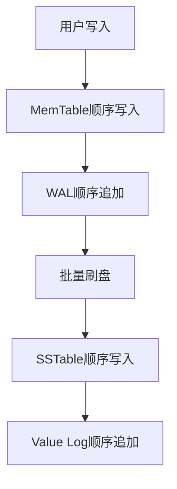
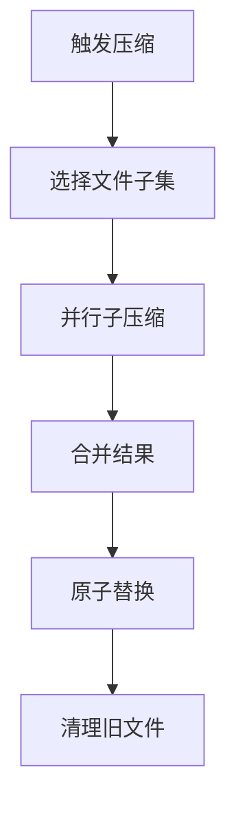

# 性能优化策略

Badger数据库在设计时充分考虑了性能优化，通过多层次的优化策略实现了高效的磁盘IO、内存管理和并发控制。

## 磁盘IO优化

### 1. 批量写入机制

WriteBatch实现，位置：`batch.go:21-53`

```go
type WriteBatch struct {
    sync.Mutex
    txn      *Txn
    db       *DB
    throttle *y.Throttle  // 限流控制
    err      atomic.Value
    isManaged bool
    commitTs  uint64
    finished  bool
}

func (db *DB) NewWriteBatch() *WriteBatch {
    return &WriteBatch{
        db:        db,
        isManaged: false,
        txn:       db.newTransaction(true, false),
        throttle:  y.NewThrottle(16),  // 16个并发写入
    }
}
```

**批量写入优势**：
- **减少系统调用**：多个操作合并为单次写入
- **提高吞吐量**：批量处理提升整体性能
- **限流控制**：防止内存使用过多

### 2. 压缩算法支持

支持ZSTD压缩，位置：`options.go:696-718`

```go
func (opt Options) WithZSTDCompressionLevel(cLevel int) Options {
    opt.ZSTDCompressionLevel = cLevel
    return opt
}
```

**压缩性能基准测试**：
- **Level 1**: 112.58 MB/s, 压缩比 2.93
- **Level 3**: 109.91 MB/s, 压缩比 2.72  
- **Level 15**: 7.47 MB/s, 压缩比 4.38

**压缩策略选择**：
- 写入密集型应用：选择低压缩级别（Level 1-3）
- 存储空间敏感：选择高压缩级别（Level 10+）
- 平衡场景：使用默认压缩级别

### 3. 预读和缓存机制

```go
// 块缓存配置
blockCache *ristretto.Cache[[]byte, *table.Block]
indexCache *ristretto.Cache[uint64, *fb.TableIndex]
```

**缓存层次**：
- **块缓存**：缓存SSTable数据块
- **索引缓存**：缓存表索引信息
- **布隆过滤器缓存**：快速判断键是否存在

### 4. 顺序写入优化



**顺序写入优势**：
- **SSD友好**：避免随机写入的性能损失
- **减少磁盘寻道**：连续IO提升吞吐量
- **写放大优化**：WiscKey架构减少不必要的写入

## 内存管理设计

### 1. 缓存策略

使用Ristretto缓存库，位置：`db.go:116-117`

```go
blockCache *ristretto.Cache[[]byte, *table.Block]
indexCache *ristretto.Cache[uint64, *fb.TableIndex]
```

**Ristretto特性**：
- **高命中率**：基于TinyLFU算法的智能淘汰
- **并发安全**：支持高并发读写
- **内存控制**：精确控制缓存内存使用

### 2. 对象池机制

使用z.AllocatorPool，位置：`db.go:118`

```go
allocPool  *z.AllocatorPool
```

**对象池优势**：
- **减少GC压力**：复用对象减少垃圾回收
- **提升分配性能**：避免频繁的内存分配
- **内存碎片优化**：统一管理内存分配

### 3. 引用计数管理

表文件引用计数，位置：`table/table.go:95`

```go
ref    atomic.Int32 // For file garbage collection
```

**引用计数机制**：
- **精确生命周期管理**：确保资源及时释放
- **防止过早释放**：避免正在使用的资源被回收
- **内存泄漏预防**：自动检测和清理未使用资源

### 4. Arena内存分配器

```go
type Arena struct {
    n          uint32
    shouldGrow bool
    buf        []byte
}
```

**Arena优势**：
- **批量分配**：减少系统调用次数
- **内存局部性**：提高缓存命中率
- **快速释放**：整块内存统一释放

## 并发控制方式

### 1. 读写锁机制

数据库级别的读写锁，位置：`db.go:85`

```go
lock sync.RWMutex // Guards list of inmemory tables
```

**锁粒度优化**：
- **粗粒度锁**：保护关键数据结构
- **细粒度锁**：减少锁竞争
- **读写分离**：允许并发读取

### 2. 原子操作

广泛使用原子操作避免锁竞争：

```go
blockWrites atomic.Int32
isClosed    atomic.Uint32
nextFileID  atomic.Uint64
```

**原子操作优势**：
- **无锁编程**：避免锁的开销
- **高并发性能**：支持大量并发操作
- **内存屏障**：保证操作的可见性

### 3. 协程池管理

限流器控制并发，位置：`levels.go:912`

```go
inflightBuilders := y.NewThrottle(8 + len(cd.splits))
```

**并发控制策略**：
- **动态调整**：根据系统负载调整并发度
- **资源保护**：防止过多协程消耗系统资源
- **背压机制**：在系统过载时自动限流

### 4. 无锁数据结构

跳表实现，位置：`skl/skl.go`

```go
type Skiplist struct {
    height     int32
    headOffset uint32
    ref        int32
    arena      *Arena
}
```

**跳表优势**：
- **并发友好**：支持无锁并发读写
- **有序性**：维护键的有序性
- **性能稳定**：O(log n)的查找复杂度

## 压缩优化策略

### 1. 智能压缩调度

基于分数计算的压缩优先级，位置：`levels.go:524-530`

```go
type compactionPriority struct {
    level        int
    score        float64      // 压缩分数
    adjusted     float64
    dropPrefixes [][]byte
    t            targets
}
```

**压缩调度算法**：
- **分数计算**：基于文件大小和重叠度
- **优先级排序**：优先处理高分数层级
- **负载均衡**：避免单层过度压缩

### 2. 并行子压缩

子压缩并发执行，位置：`levels.go:631-865`

```go
func (s *levelsController) subcompact(it y.Iterator, kr keyRange, cd compactDef,
    inflightBuilders *y.Throttle, res chan<- *table.Table) {
    
    // 检查重叠情况
    hasOverlap := s.checkOverlap(cd.allTables(), cd.nextLevel.level+1)
    
    // 选择丢弃时间戳
    discardTs := s.kv.orc.discardAtOrBelow()
    
    // 构建新表
    addKeys := func(builder *table.Builder) {
        for ; it.Valid(); it.Next() {
            // 版本控制和过期处理
            version := y.ParseTs(it.Key())
            if version <= discardTs && vs.Meta&bitMergeEntry == 0 {
                // 可以丢弃的旧版本
                numVersions++
                if numVersions == s.kv.opt.NumVersionsToKeep {
                    skipKey = y.SafeCopy(skipKey, it.Key())
                }
            }
            
            builder.Add(it.Key(), vs, vp.Len)
        }
    }
}
```

**并行压缩优势**：
- **提高吞吐量**：多个子压缩并行执行
- **减少阻塞**：避免长时间的单一压缩操作
- **资源利用**：充分利用多核CPU

### 3. 增量压缩



**增量压缩特点**：
- **渐进式处理**：避免一次性处理大量数据
- **低延迟影响**：减少对前台操作的影响
- **资源控制**：精确控制压缩资源使用

## 性能监控和调优

### 1. 性能指标收集

```go
type Metrics struct {
    NumReads                int64
    NumWrites               int64
    NumBytesRead            int64
    NumBytesWritten         int64
    NumLSMGets              int64
    NumLSMBloomHits         int64
    NumGets                 int64
    NumPuts                 int64
    NumBlockedPuts          int64
    NumMemtableGets         int64
    NumCompactions          int64
    NumLevelZeroTables      int64
    NumLevelZeroTablesStall int64
    LSMSize                 map[int]int64
    VlogSize                int64
    PendingWrites           []*Entry
}
```

### 2. 自适应调优

- **动态阈值调整**：根据负载调整压缩阈值
- **缓存大小优化**：基于命中率调整缓存大小
- **并发度控制**：根据系统资源动态调整并发数

### 3. 性能瓶颈识别

**常见瓶颈**：
- **写放大过高**：调整压缩策略和层级配置
- **读延迟增加**：优化缓存配置和布隆过滤器
- **内存使用过多**：调整MemTable大小和缓存限制
- **压缩影响前台**：优化压缩调度和并发控制

通过这些全方位的性能优化策略，Badger实现了在各种工作负载下的高性能表现。