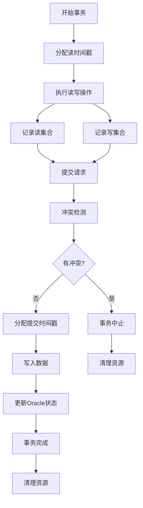
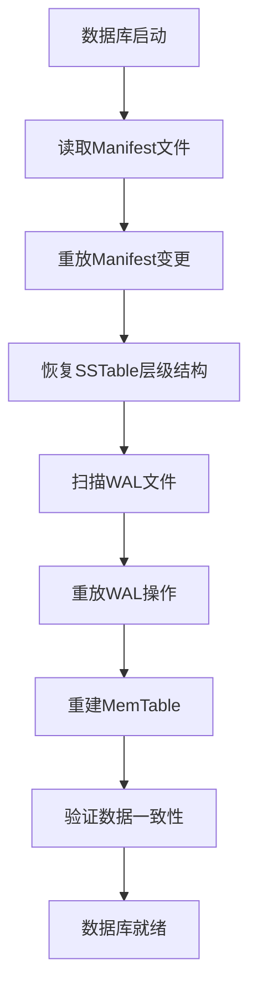

# 事务与一致性机制

Badger数据库提供完整的ACID事务支持，采用SSI（可串行化快照隔离）作为默认隔离级别，通过Oracle时间戳机制和MVCC实现高效的并发控制。

## ACID特性保证

### 1. 原子性（Atomicity）

通过事务标记机制实现，位置：`txn.go:582-591`

```go
if keepTogether {
    // 添加事务结束标记
    e := &Entry{
        Key:   y.KeyWithTs(txnKey, commitTs),
        Value: []byte(strconv.FormatUint(commitTs, 10)),
        meta:  bitFinTxn,  // 事务完成标记
    }
    entries = append(entries, e)
}
```

**实现机制**：
- 所有事务操作作为一个批次提交
- 使用事务结束标记确保原子性
- 失败时整个事务回滚

### 2. 一致性（Consistency）

通过Oracle时间戳机制保证，位置：`txn.go:24-49`

```go
type oracle struct {
    isManaged       bool
    detectConflicts bool
    sync.Mutex
    writeChLock     sync.Mutex  // 写入顺序锁
    nextTxnTs       uint64      // 下一个事务时间戳
    txnMark         *y.WaterMark // 事务水位标记
    discardTs       uint64       // 丢弃时间戳
    readMark        *y.WaterMark // 读取水位标记
    committedTxns   []committedTxn // 已提交事务
    lastCleanupTs   uint64
    closer          *z.Closer
}
```

**核心机制**：
- **时间戳排序**：每个事务分配唯一递增时间戳
- **水位标记**：跟踪事务提交状态
- **冲突检测**：在提交时检查读写冲突

### 3. 隔离性（Isolation）

#### SSI隔离级别实现

**冲突检测机制**，位置：`txn.go:127-151`

```go
func (o *oracle) hasConflict(txn *Txn) bool {
    if len(txn.reads) == 0 {
        return false
    }
    
    for _, committedTxn := range o.committedTxns {
        // 检查已提交事务的时间戳
        if committedTxn.ts <= txn.readTs {
            continue
        }
        
        // 检查读写冲突
        for _, ro := range txn.reads {
            if _, has := committedTxn.conflictKeys[ro]; has {
                return true
            }
        }
    }
    return false
}
```

**MVCC版本控制**：
- 每个键值对都带有时间戳版本
- 读事务看到的是一致性快照
- 写事务在提交时检查读写冲突

#### 事务生命周期



### 4. 持久性（Durability）

通过WAL和刷盘机制保证：

```go
// WAL写入确保持久性
if mt.wal != nil {
    if err := mt.wal.writeEntry(mt.buf, entry, mt.opt); err != nil {
        return y.Wrapf(err, "cannot write entry to WAL file")
    }
}
```

## 崩溃恢复机制

### 1. WAL（Write-Ahead Log）

每个MemTable都有对应的WAL文件，位置：`memtable.go:110-128`

```go
mt.wal = &logFile{
    fid:      uint32(fid),
    path:     filepath,
    registry: db.registry,
    writeAt:  vlogHeaderSize,
    opt:      db.opt,
}

// 设置清理回调
s.OnClose = func() {
    if err := mt.wal.Delete(); err != nil {
        db.opt.Errorf("while deleting file: %s, err: %v", filepath, err)
    }
}
```

**WAL特性**：
- **顺序写入**：所有操作按顺序写入WAL
- **同步刷盘**：关键操作强制同步到磁盘
- **自动清理**：MemTable刷盘后自动删除对应WAL

### 2. Manifest文件

记录数据库元数据变更，位置：`manifest.go:348-427`

```go
func ReplayManifestFile(fp *os.File, extMagic uint16, opt Options) (Manifest, int64, error) {
    // 读取魔数和版本
    var magicBuf [8]byte
    if _, err := io.ReadFull(&r, magicBuf[:]); err != nil {
        return Manifest{}, 0, errBadMagic
    }
    
    // 重放变更集
    for {
        // 读取变更集
        var changeSet pb.ManifestChangeSet
        if err := proto.Unmarshal(buf, &changeSet); err != nil {
            return Manifest{}, 0, err
        }
        
        // 应用变更
        if err := applyChangeSet(&build, &changeSet, opt); err != nil {
            return Manifest{}, 0, err
        }
    }
    
    return build, offset, nil
}
```

**Manifest功能**：
- **元数据记录**：记录SSTable文件的创建、删除
- **版本管理**：跟踪数据库结构变化
- **崩溃恢复**：重放变更集恢复数据库状态

### 3. 恢复流程



## 并发控制机制

### 1. 时间戳排序

```go
func (o *oracle) newCommitTs(txn *Txn) uint64 {
    o.writeChLock.Lock()
    defer o.writeChLock.Unlock()
    
    // 分配递增的提交时间戳
    o.nextTxnTs++
    return o.nextTxnTs
}
```

### 2. 读写集合跟踪

```go
type Txn struct {
    readTs   uint64
    commitTs uint64
    
    reads    []uint64        // 读集合
    writes   []*Entry        // 写集合
    
    conflictKeys map[uint64]struct{} // 冲突键集合
}
```

### 3. 冲突解决策略

- **First-Committer-Wins**：第一个提交的事务获胜
- **读写冲突检测**：检查读集合与已提交事务的写集合
- **自动重试机制**：冲突事务自动中止并可重试

## 性能优化

### 1. 批量提交

```go
type WriteBatch struct {
    sync.Mutex
    txn      *Txn
    db       *DB
    throttle *y.Throttle  // 限流控制
    err      atomic.Value
    isManaged bool
    commitTs  uint64
    finished  bool
}
```

### 2. 异步处理

- **后台Oracle清理**：定期清理过期的事务记录
- **异步WAL写入**：减少事务提交延迟
- **批量刷盘**：提高磁盘IO效率

### 3. 内存优化

- **对象池复用**：减少内存分配开销
- **延迟清理**：避免频繁的垃圾回收
- **引用计数**：精确控制资源生命周期

通过这些机制，Badger实现了高性能的ACID事务支持，在保证数据一致性的同时提供了优秀的并发性能。