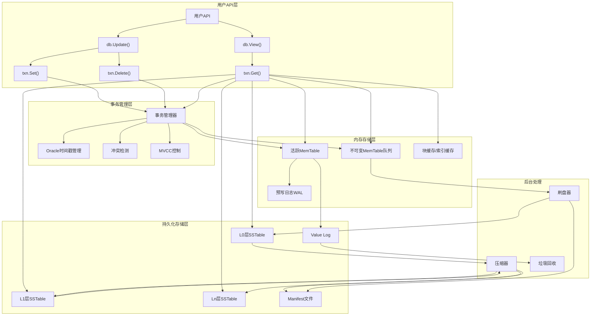
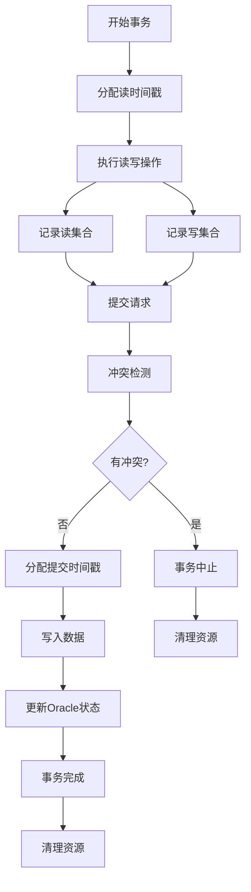
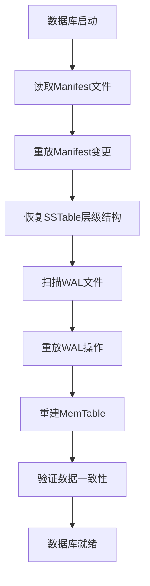
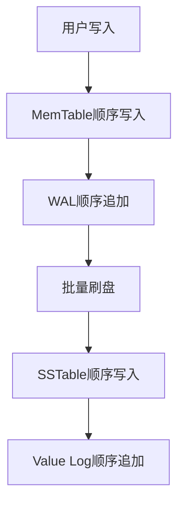
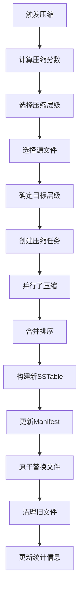

# Badger数据库源码分析完整文档

## 目录

- [项目概述](#项目概述)
- [核心存储架构](#核心存储架构)
  - [LSM树实现](#lsm树实现)
  - [数据流转路径](#数据流转路径)
  - [分层存储设计](#分层存储设计)
  - [WiscKey键值分离架构](#wisckey键值分离架构)
- [事务与一致性机制](#事务与一致性机制)
  - [ACID特性保证](#acid特性保证)
  - [SSI隔离级别实现](#ssi隔离级别实现)
  - [崩溃恢复机制](#崩溃恢复机制)
  - [并发控制机制](#并发控制机制)
- [性能优化策略](#性能优化策略)
  - [磁盘IO优化](#磁盘io优化)
  - [内存管理设计](#内存管理设计)
  - [并发控制方式](#并发控制方式)
  - [压缩优化策略](#压缩优化策略)
- [关键组件解析](#关键组件解析)
  - [索引结构实现](#索引结构实现)
  - [Compaction过程分析](#compaction过程分析)
  - [Value Log管理](#value-log管理)
  - [内存管理组件](#内存管理组件)
- [完整数据流分析](#完整数据流分析)
  - [系统架构概览](#系统架构概览)
  - [写入操作完整流程](#写入操作完整流程)
  - [读取操作完整流程](#读取操作完整流程)
  - [事务生命周期分析](#事务生命周期分析)
  - [压缩流程分析](#压缩流程分析)
  - [内存到磁盘数据流](#内存到磁盘数据流)
- [扩展性与局限性评估](#扩展性与局限性评估)
  - [支持的扩展功能](#支持的扩展功能)
  - [架构瓶颈分析](#架构瓶颈分析)
  - [适用场景分析](#适用场景分析)
- [构建类似项目的关键洞察](#构建类似项目的关键洞察)
  - [架构设计原则](#架构设计原则)
  - [关键技术选择](#关键技术选择)
  - [性能调优要点](#性能调优要点)
  - [可扩展性考虑](#可扩展性考虑)
- [技术创新点](#技术创新点)
- [总结](#总结)

---

## 项目概述

Badger是一个用纯Go语言编写的嵌入式、持久化、高性能键值数据库。它是Dgraph分布式图数据库的底层存储引擎，设计目标是成为非Go语言键值存储（如RocksDB）的高性能替代方案。

### 核心设计理念

- **基于WiscKey论文的LSM树与值日志分离架构**
- **针对SSD优化的存储设计**
- **支持ACID事务和SSI（可串行化快照隔离）**
- **纯Go实现，无CGO依赖**

---

## 核心存储架构

### LSM树实现

Badger采用基于LSM树（Log-Structured Merge Tree）的存储架构，但与传统LSM树不同的是，它实现了键值分离设计。

#### 数据结构组成

**1. MemTable（内存表）**

位置：`memtable.go:34-41`

```go
type memTable struct {
    sl         *skl.Skiplist  // 跳表实现
    wal        *logFile       // 写前日志
    maxVersion uint64         // 最大版本号
    opt        Options
    buf        *bytes.Buffer
}
```

- **跳表（Skiplist）**: 使用`skl/skl.go`中实现的跳表作为内存中的有序数据结构
- **WAL机制**: 每个memtable都有对应的WAL文件，确保崩溃恢复能力
- **版本控制**: 通过maxVersion跟踪最新的时间戳版本

**2. SSTable（磁盘表）**

位置：`table/table.go:86-109`

```go
type Table struct {
    sync.Mutex
    *z.MmapFile
    tableSize int
    _index *fb.TableIndex    // FlatBuffers索引
    _cheap *cheapIndex       // 轻量级索引
    ref    atomic.Int32      // 引用计数
    smallest, biggest []byte // 最小最大键
    id                uint64 // 文件ID
    // ... 其他字段
}
```

### 数据流转路径

#### 写入路径分析

**1. 写入MemTable**

位置：`memtable.go:170-199`

```go
func (mt *memTable) Put(key []byte, value y.ValueStruct) error {
    // 1. 构造Entry
    entry := &Entry{
        Key:       key,
        Value:     value.Value,
        UserMeta:  value.UserMeta,
        meta:      value.Meta,
        ExpiresAt: value.ExpiresAt,
    }
    
    // 2. 写入WAL（如果不是内存模式）
    if mt.wal != nil {
        if err := mt.wal.writeEntry(mt.buf, entry, mt.opt); err != nil {
            return y.Wrapf(err, "cannot write entry to WAL file")
        }
    }
    
    // 3. 写入跳表并更新版本
    mt.sl.Put(key, value)
    if ts := y.ParseTs(entry.Key); ts > mt.maxVersion {
        mt.maxVersion = ts
    }
    return nil
}
```

**2. MemTable刷盘**

位置：`db.go:1095-1128`

```go
func (db *DB) flushMemtable(lc *z.Closer) {
    defer lc.Done()
    
    for mt := range db.flushChan {
        if mt == nil {
            continue
        }
        
        for {
            if err := db.handleMemTableFlush(mt, nil); err != nil {
                // 重试机制
                db.opt.Errorf("error flushing memtable to disk: %v, retrying", err)
                time.Sleep(time.Second)
                continue
            }
            
            // 更新immutable memtable列表
            db.lock.Lock()
            y.AssertTrue(mt == db.imm[0])
            db.imm = db.imm[1:]
            mt.DecrRef() // 释放内存
            db.lock.Unlock()
            break
        }
    }
}
```

### 分层存储设计

**Level结构**

位置：`levels.go:32-41`

```go
type levelsController struct {
    nextFileID atomic.Uint64
    l0stallsMs atomic.Int64
    levels []*levelHandler  // 多层级处理器
    kv     *DB
    cstatus compactStatus   // 压缩状态
}
```

#### 分层特性详解

**L0层特性**：
- **直接刷盘**：直接从MemTable刷盘而来，无需重组键范围
- **文件重叠**：同层文件的键范围可能重叠，因为它们来自不同时间的MemTable
- **时间排序**：按文件创建时间排序，而非键值排序
- **读取复杂度**：需要检查所有L0文件，读取复杂度为O(n)

**L1-Ln层特性**：
- **压缩维护**：通过后台压缩操作维护层级结构
- **无重叠有序**：同层文件键范围完全不重叠，按键值有序排列
- **二分查找**：支持O(log n)复杂度的文件定位
- **范围查询友好**：连续键范围映射到连续文件

#### 分层存储的设计权衡

**写入vs读取性能**：
- L0层优化写入性能：直接刷盘，无需重组
- L1-Ln层优化读取性能：有序无重叠，支持高效查找

**空间利用率**：
- L0层可能存在重复数据，空间效率较低
- L1-Ln层通过压缩提高空间效率，清理重复和过期数据

**维护复杂度**：
- L0层管理简单，直接追加文件
- L1-Ln层需要复杂的压缩调度和层级管理

### WiscKey键值分离架构

Badger基于WiscKey论文实现了键值分离设计：

#### 架构优势

1. **键存储在LSM树中**：保持有序性，支持范围查询
2. **值存储在独立的值日志中**：减少写放大，提高写入性能
3. **垃圾回收机制**：定期清理无效的值日志文件

#### 系统架构图



这种设计有效减少了写放大问题，特别适合写密集型应用场景。

---

## 事务与一致性机制

Badger数据库提供完整的ACID事务支持，采用SSI（可串行化快照隔离）作为默认隔离级别，通过Oracle时间戳机制和MVCC实现高效的并发控制。

### ACID特性保证

#### 1. 原子性（Atomicity）

通过事务标记机制实现，位置：`txn.go:582-591`

```go
if keepTogether {
    // 添加事务结束标记
    e := &Entry{
        Key:   y.KeyWithTs(txnKey, commitTs),
        Value: []byte(strconv.FormatUint(commitTs, 10)),
        meta:  bitFinTxn,  // 事务完成标记
    }
    entries = append(entries, e)
}
```

**实现机制**：
- 所有事务操作作为一个批次提交
- 使用事务结束标记确保原子性
- 失败时整个事务回滚

#### 2. 一致性（Consistency）

通过Oracle时间戳机制保证，位置：`txn.go:24-49`

```go
type oracle struct {
    isManaged       bool
    detectConflicts bool
    sync.Mutex
    writeChLock     sync.Mutex  // 写入顺序锁
    nextTxnTs       uint64      // 下一个事务时间戳
    txnMark         *y.WaterMark // 事务水位标记
    discardTs       uint64       // 丢弃时间戳
    readMark        *y.WaterMark // 读取水位标记
    committedTxns   []committedTxn // 已提交事务
    lastCleanupTs   uint64
    closer          *z.Closer
}
```

**核心机制**：
- **时间戳排序**：每个事务分配唯一递增时间戳
- **水位标记**：跟踪事务提交状态
- **冲突检测**：在提交时检查读写冲突

#### 3. 隔离性（Isolation）

**MVCC版本控制**：
- 每个键值对都带有时间戳版本
- 读事务看到的是一致性快照
- 写事务在提交时检查读写冲突

#### 4. 持久性（Durability）

通过WAL和刷盘机制保证：

```go
// WAL写入确保持久性
if mt.wal != nil {
    if err := mt.wal.writeEntry(mt.buf, entry, mt.opt); err != nil {
        return y.Wrapf(err, "cannot write entry to WAL file")
    }
}
```

### SSI隔离级别实现

#### 冲突检测机制

位置：`txn.go:127-151`

```go
func (o *oracle) hasConflict(txn *Txn) bool {
    if len(txn.reads) == 0 {
        return false
    }
    
    for _, committedTxn := range o.committedTxns {
        // 检查已提交事务的时间戳
        if committedTxn.ts <= txn.readTs {
            continue
        }
        
        // 检查读写冲突
        for _, ro := range txn.reads {
            if _, has := committedTxn.conflictKeys[ro]; has {
                return true
            }
        }
    }
    return false
}
```

#### 事务生命周期



### 崩溃恢复机制

#### 1. WAL（Write-Ahead Log）

每个MemTable都有对应的WAL文件，位置：`memtable.go:110-128`

```go
mt.wal = &logFile{
    fid:      uint32(fid),
    path:     filepath,
    registry: db.registry,
    writeAt:  vlogHeaderSize,
    opt:      db.opt,
}

// 设置清理回调
s.OnClose = func() {
    if err := mt.wal.Delete(); err != nil {
        db.opt.Errorf("while deleting file: %s, err: %v", filepath, err)
    }
}
```

**WAL特性**：
- **顺序写入**：所有操作按顺序写入WAL
- **同步刷盘**：关键操作强制同步到磁盘
- **自动清理**：MemTable刷盘后自动删除对应WAL

#### 2. Manifest文件

记录数据库元数据变更，位置：`manifest.go:348-427`

```go
func ReplayManifestFile(fp *os.File, extMagic uint16, opt Options) (Manifest, int64, error) {
    // 读取魔数和版本
    var magicBuf [8]byte
    if _, err := io.ReadFull(&r, magicBuf[:]); err != nil {
        return Manifest{}, 0, errBadMagic
    }
    
    // 重放变更集
    for {
        // 读取变更集
        var changeSet pb.ManifestChangeSet
        if err := proto.Unmarshal(buf, &changeSet); err != nil {
            return Manifest{}, 0, err
        }
        
        // 应用变更
        if err := applyChangeSet(&build, &changeSet, opt); err != nil {
            return Manifest{}, 0, err
        }
    }
    
    return build, offset, nil
}
```

**Manifest功能**：
- **元数据记录**：记录SSTable文件的创建、删除
- **版本管理**：跟踪数据库结构变化
- **崩溃恢复**：重放变更集恢复数据库状态

#### 3. 恢复流程



### 并发控制机制

#### 1. 时间戳排序

```go
func (o *oracle) newCommitTs(txn *Txn) uint64 {
    o.writeChLock.Lock()
    defer o.writeChLock.Unlock()
    
    // 分配递增的提交时间戳
    o.nextTxnTs++
    return o.nextTxnTs
}
```

#### 2. 读写集合跟踪

```go
type Txn struct {
    readTs   uint64
    commitTs uint64
    
    reads    []uint64        // 读集合
    writes   []*Entry        // 写集合
    
    conflictKeys map[uint64]struct{} // 冲突键集合
}
```

#### 3. 冲突解决策略

- **First-Committer-Wins**：第一个提交的事务获胜
- **读写冲突检测**：检查读集合与已提交事务的写集合
- **自动重试机制**：冲突事务自动中止并可重试

---

## 性能优化策略

Badger数据库在设计时充分考虑了性能优化，通过多层次的优化策略实现了高效的磁盘IO、内存管理和并发控制。

### 磁盘IO优化

#### 1. 批量写入机制

WriteBatch实现，位置：`batch.go:21-53`

```go
type WriteBatch struct {
    sync.Mutex
    txn      *Txn
    db       *DB
    throttle *y.Throttle  // 限流控制
    err      atomic.Value
    isManaged bool
    commitTs  uint64
    finished  bool
}

func (db *DB) NewWriteBatch() *WriteBatch {
    return &WriteBatch{
        db:        db,
        isManaged: false,
        txn:       db.newTransaction(true, false),
        throttle:  y.NewThrottle(16),  // 16个并发写入
    }
}
```

**批量写入优势**：
- **减少系统调用**：多个操作合并为单次写入
- **提高吞吐量**：批量处理提升整体性能
- **限流控制**：防止内存使用过多

#### 2. 压缩算法支持

支持ZSTD压缩，位置：`options.go:696-718`

```go
func (opt Options) WithZSTDCompressionLevel(cLevel int) Options {
    opt.ZSTDCompressionLevel = cLevel
    return opt
}
```

**压缩性能基准测试**：
- **Level 1**: 112.58 MB/s, 压缩比 2.93
- **Level 3**: 109.91 MB/s, 压缩比 2.72  
- **Level 15**: 7.47 MB/s, 压缩比 4.38

#### 3. 顺序写入优化



**顺序写入优势**：
- **SSD友好**：避免随机写入的性能损失
- **减少磁盘寻道**：连续IO提升吞吐量
- **写放大优化**：WiscKey架构减少不必要的写入

### 内存管理设计

#### 1. 缓存策略

使用Ristretto缓存库，位置：`db.go:116-117`

```go
blockCache *ristretto.Cache[[]byte, *table.Block]
indexCache *ristretto.Cache[uint64, *fb.TableIndex]
```

**Ristretto特性**：
- **高命中率**：基于TinyLFU算法的智能淘汰
- **并发安全**：支持高并发读写
- **内存控制**：精确控制缓存内存使用

#### 2. 对象池机制

使用z.AllocatorPool，位置：`db.go:118`

```go
allocPool  *z.AllocatorPool
```

**对象池优势**：
- **减少GC压力**：复用对象减少垃圾回收
- **提升分配性能**：避免频繁的内存分配
- **内存碎片优化**：统一管理内存分配

#### 3. 引用计数管理

表文件引用计数，位置：`table/table.go:95`

```go
ref    atomic.Int32 // For file garbage collection
```

**引用计数机制**：
- **精确生命周期管理**：确保资源及时释放
- **防止过早释放**：避免正在使用的资源被回收
- **内存泄漏预防**：自动检测和清理未使用资源

### 并发控制方式

#### 1. 读写锁机制

数据库级别的读写锁，位置：`db.go:85`

```go
lock sync.RWMutex // Guards list of inmemory tables
```

**锁粒度优化**：
- **粗粒度锁**：保护关键数据结构
- **细粒度锁**：减少锁竞争
- **读写分离**：允许并发读取

#### 2. 原子操作

广泛使用原子操作避免锁竞争：

```go
blockWrites atomic.Int32
isClosed    atomic.Uint32
nextFileID  atomic.Uint64
```

**原子操作优势**：
- **无锁编程**：避免锁的开销
- **高并发性能**：支持大量并发操作
- **内存屏障**：保证操作的可见性

#### 3. 协程池管理

限流器控制并发，位置：`levels.go:912`

```go
inflightBuilders := y.NewThrottle(8 + len(cd.splits))
```

**并发控制策略**：
- **动态调整**：根据系统负载调整并发度
- **资源保护**：防止过多协程消耗系统资源
- **背压机制**：在系统过载时自动限流

### 压缩优化策略

#### 1. 智能压缩调度

基于分数计算的压缩优先级，位置：`levels.go:524-530`

```go
type compactionPriority struct {
    level        int
    score        float64      // 压缩分数
    adjusted     float64
    dropPrefixes [][]byte
    t            targets
}
```

**压缩调度算法**：
- **分数计算**：基于文件大小和重叠度
- **优先级排序**：优先处理高分数层级
- **负载均衡**：避免单层过度压缩

#### 2. 并行子压缩

子压缩并发执行，位置：`levels.go:631-865`

```go
func (s *levelsController) subcompact(it y.Iterator, kr keyRange, cd compactDef,
    inflightBuilders *y.Throttle, res chan<- *table.Table) {
    
    // 检查重叠情况
    hasOverlap := s.checkOverlap(cd.allTables(), cd.nextLevel.level+1)
    
    // 选择丢弃时间戳
    discardTs := s.kv.orc.discardAtOrBelow()
    
    // 构建新表
    addKeys := func(builder *table.Builder) {
        for ; it.Valid(); it.Next() {
            // 版本控制和过期处理
            version := y.ParseTs(it.Key())
            if version <= discardTs && vs.Meta&bitMergeEntry == 0 {
                // 可以丢弃的旧版本
                numVersions++
                if numVersions == s.kv.opt.NumVersionsToKeep {
                    skipKey = y.SafeCopy(skipKey, it.Key())
                }
            }
            
            builder.Add(it.Key(), vs, vp.Len)
        }
    }
}
```

**并行压缩优势**：
- **提高吞吐量**：多个子压缩并行执行
- **减少阻塞**：避免长时间的单一压缩操作
- **资源利用**：充分利用多核CPU

---

## 关键组件解析

Badger数据库包含多个关键组件，每个组件都有其特定的功能和优化策略。

### 索引结构实现

#### 1. 布隆过滤器

位置：`y/bloom.go:9-10`

```go
type Filter []byte
```

**布隆过滤器实现**：

```go
func (f Filter) MayContain(key []byte) bool {
    if len(f) < 2 {
        return false
    }
    k := f[len(f)-1]
    if k > 30 {
        return true
    }
    nBits := uint32(8 * (len(f) - 1))
    delta := (uint32(xxhash.Sum64(key)) >> 17) | (uint32(xxhash.Sum64(key)) << 15)
    h := uint32(xxhash.Sum64(key))
    for i := uint8(0); i < k; i++ {
        bitPos := h % nBits
        if f[bitPos/8]&(1<<(bitPos%8)) == 0 {
            return false
        }
        h += delta
    }
    return true
}
```

**布隆过滤器特性**：
- **快速判断**：O(k)时间复杂度判断键是否可能存在
- **空间效率**：使用位数组，内存占用小
- **误判控制**：只有假阳性，没有假阴性
- **哈希函数**：使用xxhash实现高性能哈希

#### 2. FlatBuffers索引

使用FlatBuffers序列化格式，位置：`table/table.go:93`

```go
_index *fb.TableIndex // Nil if encryption is enabled
```

**FlatBuffers优势**：
- **零拷贝访问**：直接从内存映射文件读取
- **高效序列化**：无需反序列化即可访问数据
- **跨平台兼容**：标准化的二进制格式
- **内存对齐**：优化CPU缓存性能

#### 3. 跳表索引

MemTable使用跳表作为内存索引，位置：`skl/skl.go`

```go
type Skiplist struct {
    height     int32    // 当前最大高度
    headOffset uint32   // 头节点偏移
    ref        int32    // 引用计数
    arena      *Arena   // 内存分配器
}
```

**跳表特性**：
- **有序性**：维护键的有序排列
- **并发安全**：支持无锁并发读写
- **性能稳定**：平均O(log n)的查找复杂度
- **内存效率**：使用Arena分配器减少碎片

### Compaction过程分析

#### 1. 触发条件

基于分数计算的压缩优先级：

```go
func (s *levelsController) pickCompactLevels() (prios []compactionPriority) {
    // 计算每层的压缩分数
    for i, l := range s.levels {
        // L0层特殊处理
        if i == 0 {
            // 基于文件数量计算
            if len(l.tables) >= s.kv.opt.NumLevelZeroTables {
                pri := compactionPriority{
                    level: i,
                    score: float64(len(l.tables)) / float64(s.kv.opt.NumLevelZeroTables),
                }
                prios = append(prios, pri)
            }
        } else {
            // 其他层基于大小计算
            if l.getTotalSize() >= l.maxTotalSize {
                pri := compactionPriority{
                    level: i,
                    score: float64(l.getTotalSize()) / float64(l.maxTotalSize),
                }
                prios = append(prios, pri)
            }
        }
    }
    
    // 按分数排序
    sort.Slice(prios, func(i, j int) bool {
        return prios[i].score > prios[j].score
    })
    
    return prios
}
```

#### 2. 压缩流程图



### Value Log管理

#### 1. Value Log结构

```go
type valueLog struct {
    buf        *bytes.Buffer
    dirPath    string
    elog       trace.EventLog
    filesToDelete []uint32
    
    // Value log files.
    filesMap map[uint32]*logFile
    filesLock sync.RWMutex
    maxFid   uint32
    
    // Garbage collection
    garbageCh      chan struct{}
    lfDiscardStats *lfDiscardStats
}
```

**Value Log特性**：
- **顺序写入**：所有值按顺序追加写入
- **垃圾回收**：定期清理无效数据
- **文件轮转**：达到大小限制时创建新文件
- **并发安全**：支持并发读写操作

#### 2. 垃圾回收机制

```go
func (vlog *valueLog) runGC(discardRatio float64) error {
    select {
    case vlog.garbageCh <- struct{}{}:
        // 获取GC权限
    default:
        return ErrNoRewrite
    }
    defer func() {
        <-vlog.garbageCh
    }()
    
    // 选择需要GC的文件
    lf := vlog.pickLog(discardRatio)
    if lf == nil {
        return ErrNoRewrite
    }
    
    // 执行GC
    return vlog.doRunGC(lf)
}
```

**GC策略**：
- **基于比例**：当无效数据比例超过阈值时触发
- **文件选择**：优先选择无效数据最多的文件
- **重写机制**：将有效数据写入新文件
- **原子替换**：确保GC过程的一致性

### 内存管理组件

#### 1. Arena分配器

```go
type Arena struct {
    n          uint32    // 当前偏移量
    shouldGrow bool      // 是否需要扩容
    buf        []byte    // 内存缓冲区
}
```

**Arena特性**：
- **批量分配**：一次性分配大块内存
- **快速分配**：O(1)时间复杂度
- **内存对齐**：确保数据结构对齐
- **统一释放**：整个Arena一次性释放

#### 2. 缓存管理

使用Ristretto缓存库实现高效缓存：

```go
// 块缓存配置
blockCache, err := ristretto.NewCache(&ristretto.Config[[]byte, *Block]{
    NumCounters: 1e7,     // 计数器数量
    MaxCost:     1 << 30, // 最大成本（1GB）
    BufferItems: 64,      // 缓冲区大小
})

// 索引缓存配置
indexCache, err := ristretto.NewCache(&ristretto.Config[uint64, *fb.TableIndex]{
    NumCounters: 1e6,     // 计数器数量
    MaxCost:     1 << 28, // 最大成本（256MB）
    BufferItems: 64,      // 缓冲区大小
})
```

**缓存策略**：
- **LFU淘汰**：基于访问频率的智能淘汰
- **成本控制**：基于内存使用量的精确控制
- **并发安全**：支持高并发访问
- **统计信息**：提供详细的缓存统计

---

## 完整数据流分析

### 系统架构概览

Badger采用基于LSM树的存储架构，结合WiscKey论文的键值分离设计，实现了高效的写入性能和合理的读取性能。

### 写入操作完整流程

#### 写入流程图

```mermaid
flowchart TD
    %% 用户写入入口
    Start["用户调用 db.Update()"] --> CreateTxn["创建读写事务 NewTransaction(true)"]
    
    %% 事务操作
    CreateTxn --> UserFunc["执行用户函数 fn(txn)"]
    UserFunc --> SetOp["txn.Set(key, value)"]
    SetOp --> ModifyEntry["txn.modify(entry)"]
    
    %% 事务内部处理
    ModifyEntry --> ValidateEntry["验证Entry大小和权限"]
    ValidateEntry --> ConflictTrack["记录冲突检测键 conflictKeys[hash]"]
    ConflictTrack --> PendingWrites["加入待写入队列 pendingWrites[key]"]
    
    %% 提交流程
    PendingWrites --> CommitCall["txn.Commit()"]
    CommitCall --> CommitPrecheck["提交前检查 commitPrecheck()"]
    CommitPrecheck --> CommitAndSend["commitAndSend()"]
    
    %% Oracle时间戳管理
    CommitAndSend --> GetCommitTs["Oracle获取提交时间戳 newCommitTs()"]
    GetCommitTs --> ConflictCheck{"检查读写冲突"}
    ConflictCheck -->|冲突| ReturnConflict["返回 ErrConflict"]
    ConflictCheck -->|无冲突| ProcessEntries["处理Entry列表"]
    
    %% Entry处理
    ProcessEntries --> AddTimestamp["为Key添加时间戳后缀 KeyWithTs()"]
    AddTimestamp --> AddTxnMarker["添加事务标记 bitTxn"]
    AddTxnMarker --> SendToWriteCh["发送到写入通道 sendToWriteCh()"]
    
    %% 写入通道处理
    SendToWriteCh --> WriteChQueue["写入通道队列 writeCh"]
    WriteChQueue --> DoWrites["后台写入协程 doWrites()"]
    DoWrites --> BatchRequests["批量处理请求 writeRequests()"]
    
    %% Value Log写入
    BatchRequests --> WriteVLog["写入Value Log vlog.write()"]
    WriteVLog --> CheckThreshold{"值大小 > ValueThreshold?"}
    CheckThreshold -->|是| StoreInVLog["存储到Value Log"]
    CheckThreshold -->|否| StoreInline["内联存储"]
    
    %% MemTable写入
    StoreInVLog --> WriteToLSM["写入LSM树 writeToLSM()"]
    StoreInline --> WriteToLSM
    WriteToLSM --> MemTablePut["MemTable.Put()"]
    MemTablePut --> WALWrite["写入WAL日志"]
    WALWrite --> SkipListPut["写入SkipList"]
    
    %% 内存管理
    SkipListPut --> CheckMemFull{"MemTable已满?"}
    CheckMemFull -->|否| WriteComplete["写入完成"]
    CheckMemFull -->|是| FlushMemTable["刷新MemTable"]
    
    %% 刷盘流程
    FlushMemTable --> MoveToImm["移动到不可变队列 imm"]
    MoveToImm --> CreateNewMem["创建新的MemTable"]
    CreateNewMem --> FlushToDisk["后台刷盘 flushMemtable()"]
    FlushToDisk --> BuildL0Table["构建L0 SSTable"]
    BuildL0Table --> AddToL0["添加到L0层"]
    AddToL0 --> WriteComplete
```



#### 关键函数调用链

**写入操作关键调用链**：
1. `db.Update(fn)` → `db.NewTransaction(true)` → `fn(txn)` 
2. `txn.Set(key, val)` → `txn.SetEntry(entry)` → `txn.modify(entry)`
3. `txn.Commit()` → `txn.commitAndSend()` → `orc.newCommitTs(txn)`
4. `db.sendToWriteCh(entries)` → `db.doWrites()` → `db.writeRequests()`
5. `db.writeToLSM(batch)` → `mt.Put(key, value)` → `mt.wal.writeEntry()`
6. `db.flushMemtable()` → `db.handleMemTableFlush()` → `db.lc.addLevel0Table()`

### 读取操作完整流程

#### 读取流程图

```mermaid
flowchart TD
    %% 用户读取入口
    Start["用户调用 db.View()"] --> CreateReadTxn["创建只读事务 NewTransaction(false)"]
    
    %% 事务操作
    CreateReadTxn --> SetReadTs["设置读取时间戳 readTs"]
    SetReadTs --> UserFunc["执行用户函数 fn(txn)"]
    UserFunc --> GetOp["txn.Get(key)"]
    
    %% 读取处理
    GetOp --> ValidateKey["验证Key有效性"]
    ValidateKey --> CheckPendingWrites{"检查事务内待写入"}
    CheckPendingWrites -->|找到| ReturnFromCache["从事务缓存返回"]
    CheckPendingWrites -->|未找到| AddReadKey["记录读取Key addReadKey()"]
    
    %% 数据库查找
    AddReadKey --> CreateSeekKey["创建带时间戳的Key KeyWithTs()"]
    CreateSeekKey --> DBGet["调用 db.get()"]
    
    %% MemTable查找
    DBGet --> GetMemTables["获取MemTable列表 getMemTables()"]
    GetMemTables --> SearchActiveMT["搜索活跃MemTable"]
    SearchActiveMT --> CheckActiveResult{"在活跃MemTable中找到?"}
    CheckActiveResult -->|找到且版本匹配| ReturnValue["返回值"]
    CheckActiveResult -->|找到但版本不匹配| RecordMaxVersion["记录最大版本"]
    CheckActiveResult -->|未找到| SearchImmMT["搜索不可变MemTable队列"]
    
    %% 不可变MemTable查找
    SearchImmMT --> IterateImmTables["遍历imm队列"]
    IterateImmTables --> CheckImmResult{"在imm中找到?"}
    CheckImmResult -->|找到且版本匹配| ReturnValue
    CheckImmResult -->|找到但版本不匹配| RecordMaxVersion
    CheckImmResult -->|未找到| SearchLSM["搜索LSM树 lc.get()"]
    
    %% LSM树查找
    SearchLSM --> SearchL0["搜索L0层"]
    SearchL0 --> IterateL0Tables["遍历L0所有表(时间顺序)"]
    IterateL0Tables --> CheckBloomFilter["检查布隆过滤器"]
    CheckBloomFilter -->|可能存在| SearchInTable["在表中查找"]
    CheckBloomFilter -->|不存在| NextL0Table["下一个L0表"]
    SearchInTable --> CheckTableResult{"在表中找到?"}
    CheckTableResult -->|找到| CheckValuePointer{"是否为值指针?"}
    CheckTableResult -->|未找到| NextL0Table
    NextL0Table --> MoreL0Tables{"还有L0表?"}
    MoreL0Tables -->|是| IterateL0Tables
    MoreL0Tables -->|否| SearchL1Plus["搜索L1+层"]
    
    %% L1+层查找
    SearchL1Plus --> BinarySearchLevel["二分查找定位表"]
    BinarySearchLevel --> CheckL1BloomFilter["检查布隆过滤器"]
    CheckL1BloomFilter -->|可能存在| SearchInL1Table["在表中查找"]
    CheckL1BloomFilter -->|不存在| NextLevel["下一层级"]
    SearchInL1Table --> CheckL1Result{"在表中找到?"}
    CheckL1Result -->|找到| CheckValuePointer
    CheckL1Result -->|未找到| NextLevel
    NextLevel --> MoreLevels{"还有更多层级?"}
    MoreLevels -->|是| SearchL1Plus
    MoreLevels -->|否| NotFound["返回 ErrKeyNotFound"]
    
    %% 值指针处理
    CheckValuePointer -->|是值指针| ReadFromVLog["从Value Log读取 vlog.read()"]
    CheckValuePointer -->|直接值| ReturnDirectValue["返回直接值"]
    ReadFromVLog --> DecryptValue["解密值(如果加密)"]
    DecryptValue --> ReturnValue
    ReturnDirectValue --> ReturnValue
    
    %% 缓存处理
    ReturnValue --> UpdateCache["更新块缓存"]
    UpdateCache --> Complete["读取完成"]
    
    RecordMaxVersion --> SearchLSM
    ReturnFromCache --> Complete
    NotFound --> Complete
```



### 事务生命周期分析

#### 事务生命周期图

```mermaid
flowchart TD
    %% 事务创建
    Start["事务开始"] --> CreateTxn["NewTransaction(update)"]
    CreateTxn --> SetReadTs["设置读取时间戳 readTs = oracle.readTs()"]
    
    %% 事务类型分支
    SetReadTs --> TxnType{"事务类型"}
    TxnType -->|只读| ReadOnlyTxn["只读事务"]
    TxnType -->|读写| ReadWriteTxn["读写事务"]
    
    %% 只读事务流程
    ReadOnlyTxn --> ReadOps["执行读取操作"]
    ReadOps --> ReadFromSnapshot["从快照读取数据"]
    ReadFromSnapshot --> ReadComplete["读取完成"]
    ReadComplete --> DiscardReadTxn["txn.Discard()"]
    
    %% 读写事务流程
    ReadWriteTxn --> InitConflictTracking["初始化冲突跟踪 conflictKeys"]
    InitConflictTracking --> InitPendingWrites["初始化待写入队列 pendingWrites"]
    
    %% 事务操作阶段
    InitPendingWrites --> TxnOperations["事务操作阶段"]
    TxnOperations --> ReadWriteOps["读写操作"]
    
    %% 读操作处理
    ReadWriteOps --> ReadOp["txn.Get()"]
    ReadOp --> TrackReadKey["记录读取键 addReadKey()"]
    TrackReadKey --> ReadData["读取数据"]
    ReadData --> BackToOps["继续操作"]
    
    %% 写操作处理
    ReadWriteOps --> WriteOp["txn.Set() / txn.Delete()"]
    WriteOp --> ValidateWrite["验证写入"]
    ValidateWrite --> AddToConflictKeys["添加到冲突键集合"]
    AddToConflictKeys --> AddToPendingWrites["添加到待写入队列"]
    AddToPendingWrites --> BackToOps
    
    %% 提交阶段
    BackToOps --> CommitDecision{"准备提交"}
    CommitDecision -->|继续操作| ReadWriteOps
    CommitDecision -->|提交| CommitPhase["提交阶段"]
    CommitDecision -->|放弃| DiscardTxn["txn.Discard()"]
    
    %% 提交流程
    CommitPhase --> CommitPrecheck["提交前检查"]
    CommitPrecheck --> AcquireWriteLock["获取写入锁 writeChLock"]
    AcquireWriteLock --> GetCommitTs["获取提交时间戳 newCommitTs()"]
    
    %% Oracle冲突检测
    GetCommitTs --> ConflictDetection["Oracle冲突检测"]
    ConflictDetection --> CheckReadKeys["检查读取键是否被修改"]
    CheckReadKeys --> ConflictResult{"冲突检测结果"}
    ConflictResult -->|有冲突| ReleaseWriteLock["释放写入锁"]
    ReleaseWriteLock --> ReturnConflict["返回 ErrConflict"]
    ConflictResult -->|无冲突| ProcessCommit["处理提交"]
    
    %% 提交处理
    ProcessCommit --> SetEntryVersions["设置Entry版本号"]
    SetEntryVersions --> AddTxnMarkers["添加事务标记"]
    AddTxnMarkers --> CreateTxnEndMarker["创建事务结束标记"]
    CreateTxnEndMarker --> SendToWriteChannel["发送到写入通道"]
    
    %% 异步写入
    SendToWriteChannel --> ReleaseWriteLockSuccess["释放写入锁"]
    ReleaseWriteLockSuccess --> AsyncWrite["异步写入处理"]
    AsyncWrite --> WriteToVLog["写入Value Log"]
    WriteToVLog --> WriteToMemTable["写入MemTable"]
    WriteToMemTable --> WriteToWAL["写入WAL"]
    WriteToWAL --> CommitComplete["提交完成"]
    
    %% Oracle状态更新
    CommitComplete --> UpdateOracle["更新Oracle状态"]
    UpdateOracle --> DoneCommit["标记提交完成 doneCommit()"]
    DoneCommit --> NotifyWaiters["通知等待者"]
    
    %% 事务清理
    NotifyWaiters --> DiscardCommittedTxn["txn.Discard()"]
    DiscardReadTxn --> TxnEnd["事务结束"]
    DiscardTxn --> TxnEnd
    DiscardCommittedTxn --> TxnEnd
    ReturnConflict --> DiscardConflictTxn["txn.Discard()"]
    DiscardConflictTxn --> TxnEnd
```



### 压缩流程分析

#### 压缩流程图

```mermaid
flowchart TD
    %% 压缩触发
    Start["压缩触发"] --> TriggerTypes{"触发类型"}
    TriggerTypes -->|定时检查| PeriodicCheck["定时检查 50ms ticker"]
    TriggerTypes -->|L0表数量| L0Overflow["L0表数量超限"]
    TriggerTypes -->|层级大小| LevelSize["层级大小超限"]
    TriggerTypes -->|手动触发| ManualTrigger["手动压缩"]
    
    %% 压缩优先级计算
    PeriodicCheck --> CalcPriority["计算压缩优先级 pickCompactLevels()"]
    L0Overflow --> CalcPriority
    LevelSize --> CalcPriority
    ManualTrigger --> CalcPriority
    
    %% 优先级计算详情
    CalcPriority --> L0Priority["L0优先级 = 表数量 / NumLevelZeroTables"]
    CalcPriority --> LnPriority["Ln优先级 = 当前大小 / 目标大小"]
    L0Priority --> AdjustPriority["调整优先级 (PebbleDB算法)"]
    LnPriority --> AdjustPriority
    AdjustPriority --> SortByPriority["按调整后优先级排序"]
    
    %% 选择压缩任务
    SortByPriority --> SelectCompaction["选择压缩任务"]
    SelectCompaction --> CheckScore{"优先级 >= 1.0?"}
    CheckScore -->|否| NoCompaction["无需压缩"]
    CheckScore -->|是| DoCompaction["执行压缩 doCompact()"]
    
    %% 压缩类型判断
    DoCompaction --> CompactionType{"压缩类型"}
    CompactionType -->|L0->Lbase| L0Compaction["L0压缩"]
    CompactionType -->|Li->Li+1| LevelCompaction["层级压缩"]
    CompactionType -->|Lmax->Lmax| LmaxCompaction["最大层内压缩"]
    
    %% L0压缩流程
    L0Compaction --> SelectL0Tables["选择L0表 (所有表)"]
    SelectL0Tables --> FindTargetLevel["确定目标层级 Lbase"]
    FindTargetLevel --> SelectOverlapTables["选择重叠表"]
    SelectOverlapTables --> CreateCompactDef["创建压缩定义 compactDef"]
    
    %% 层级压缩流程
    LevelCompaction --> SelectSourceTable["选择源表 (单个表)"]
    SelectSourceTable --> FindOverlapNext["查找下一层重叠表"]
    FindOverlapNext --> CreateCompactDef
    
    %% Lmax压缩流程
    LmaxCompaction --> SelectLmaxTables["选择最大层表"]
    SelectLmaxTables --> CreateCompactDef
    
    %% 压缩执行
    CreateCompactDef --> RunCompactDef["执行压缩定义 runCompactDef()"]
    RunCompactDef --> AcquireLock["获取压缩锁"]
    AcquireLock --> CheckConflict["检查表冲突"]
    CheckConflict -->|有冲突| ReleaseLock["释放锁"]
    ReleaseLock --> RetryLater["稍后重试"]
    CheckConflict -->|无冲突| MarkTablesInUse["标记表正在使用"]
    
    %% 压缩构建
    MarkTablesInUse --> CompactBuildTables["构建新表 compactBuildTables()"]
    CompactBuildTables --> CreateIterators["创建迭代器"]
    CreateIterators --> DetermineKeySplits["确定键范围分割"]
    DetermineKeySplits --> ParallelSubcompact["并行子压缩 subcompact()"]
    
    %% 子压缩处理
    ParallelSubcompact --> IterateKeys["遍历键值对"]
    IterateKeys --> VersionFiltering["版本过滤"]
    VersionFiltering --> DiscardOldVersions["丢弃旧版本"]
    DiscardOldVersions --> HandleExpiredKeys["处理过期键"]
    HandleExpiredKeys --> BuildNewTable["构建新SSTable"]
    
    %% 表构建
    BuildNewTable --> WriteTableData["写入表数据"]
    WriteTableData --> CreateBloomFilter["创建布隆过滤器"]
    CreateBloomFilter --> CreateIndex["创建索引"]
    CreateIndex --> FinalizeTable["完成表构建"]
    
    %% 并发控制
    FinalizeTable --> WaitAllSubcompacts["等待所有子压缩完成"]
    WaitAllSubcompacts --> SortNewTables["排序新表"]
    SortNewTables --> UpdateManifest["更新Manifest文件"]
    
    %% Manifest更新
    UpdateManifest --> CreateChangeSet["创建变更集 ManifestChangeSet"]
    CreateChangeSet --> AddCreateChanges["添加新表创建记录"]
    AddCreateChanges --> AddDeleteChanges["添加旧表删除记录"]
    AddDeleteChanges --> ApplyChanges["应用变更到Manifest"]
    
    %% 层级更新
    ApplyChanges --> UpdateLevelHandler["更新层级处理器"]
    UpdateLevelHandler --> AddNewTables["添加新表到目标层"]
    AddNewTables --> RemoveOldTables["从源层移除旧表"]
    RemoveOldTables --> UpdateLevelStats["更新层级统计"]
    
    %% 清理工作
    UpdateLevelStats --> DecrRefOldTables["减少旧表引用计数"]
    DecrRefOldTables --> DeleteOldFiles["删除旧表文件"]
    DeleteOldFiles --> UpdateDiscardStats["更新丢弃统计"]
    UpdateDiscardStats --> ReleaseFinalLock["释放压缩锁"]
    
    %% 完成
    ReleaseFinalLock --> CompactionComplete["压缩完成"]
    NoCompaction --> WaitNextCycle["等待下一轮检查"]
    RetryLater --> WaitNextCycle
    CompactionComplete --> WaitNextCycle
    WaitNextCycle --> PeriodicCheck
```



### 内存到磁盘数据流

#### 数据流转图

```mermaid
flowchart TD
    %% 数据写入入口
    Start["数据写入请求"] --> ValueSizeCheck{"值大小检查"}
    ValueSizeCheck -->|> ValueThreshold| SeparateStorage["键值分离存储"]
    ValueSizeCheck -->|<= ValueThreshold| InlineStorage["内联存储"]
    
    %% 键值分离存储路径
    SeparateStorage --> WriteValueLog["写入Value Log"]
    WriteValueLog --> VLogAppend["追加到vlog文件"]
    VLogAppend --> VLogSync["同步vlog (可选)"]
    VLogSync --> CreateValuePointer["创建值指针 valuePointer"]
    CreateValuePointer --> WriteKeyToMem["写入Key+指针到内存"]
    
    %% 内联存储路径
    InlineStorage --> WriteKeyToMem["写入Key+Value到内存"]
    
    %% 内存写入流程
    WriteKeyToMem --> WALWrite["写入WAL日志"]
    WALWrite --> WALEncode["编码Entry到WAL"]
    WALEncode --> WALFlush["刷新WAL到磁盘"]
    WALFlush --> SkipListWrite["写入SkipList"]
    SkipListWrite --> UpdateMemSize["更新内存使用"]
    
    %% 内存管理
    UpdateMemSize --> CheckMemFull{"MemTable已满?"}
    CheckMemFull -->|否| WriteComplete["写入完成"]
    CheckMemFull -->|是| TriggerFlush["触发刷盘"]
    
    %% 刷盘流程
    TriggerFlush --> MoveToImmutable["移动到不可变队列"]
    MoveToImmutable --> CreateNewMemTable["创建新MemTable"]
    CreateNewMemTable --> FlushToL0["刷盘到L0层"]
    
    %% L0层构建
    FlushToL0 --> CreateIterator["创建MemTable迭代器"]
    CreateIterator --> BuildSSTable["构建SSTable"]
    BuildSSTable --> WriteDataBlocks["写入数据块"]
    WriteDataBlocks --> CreateBloomFilter["创建布隆过滤器"]
    CreateBloomFilter --> WriteIndexBlock["写入索引块"]
    WriteIndexBlock --> WriteMetaBlock["写入元数据块"]
    WriteMetaBlock --> WriteFooter["写入文件尾部"]
    WriteFooter --> SyncSSTable["同步SSTable到磁盘"]
    
    %% L0层管理
    SyncSSTable --> AddToL0["添加到L0层"]
    AddToL0 --> UpdateManifest["更新Manifest文件"]
    UpdateManifest --> DeleteWAL["删除对应WAL文件"]
    DeleteWAL --> L0Complete["L0写入完成"]
    
    %% 压缩触发
    L0Complete --> CheckL0Count{"L0表数量检查"}
    CheckL0Count -->|< 阈值| FlushComplete["刷盘完成"]
    CheckL0Count -->|>= 阈值| TriggerCompaction["触发压缩"]
    
    %% 压缩流程
    TriggerCompaction --> SelectTables["选择压缩表"]
    SelectTables --> MergeSort["归并排序"]
    MergeSort --> VersionFiltering["版本过滤"]
    VersionFiltering --> BuildNewL1["构建新L1表"]
    BuildNewL1 --> WriteL1SSTable["写入L1 SSTable"]
    WriteL1SSTable --> UpdateL1Level["更新L1层"]
    UpdateL1Level --> RemoveOldL0["移除旧L0表"]
    RemoveOldL0 --> CompactionComplete["压缩完成"]
    
    %% 多层压缩
    CompactionComplete --> CheckLevelSize{"检查层级大小"}
    CheckLevelSize -->|超限| TriggerNextLevel["触发下层压缩"]
    CheckLevelSize -->|正常| AllComplete["全部完成"]
    TriggerNextLevel --> SelectNextLevelTables["选择下层表"]
    SelectNextLevelTables --> MergeSort
    
    %% 读取路径
    ReadRequest["读取请求"] --> CheckCache["检查缓存"]
    CheckCache -->|命中| ReturnCached["返回缓存数据"]
    CheckCache -->|未命中| SearchMemory["搜索内存层"]
    SearchMemory --> SearchL0["搜索L0层"]
    SearchL0 --> SearchL1Plus["搜索L1+层"]
    SearchL1Plus --> ReadFromDisk["从磁盘读取"]
    ReadFromDisk --> UpdateCacheOnRead["更新缓存"]
```



---

## 扩展性与局限性评估

### 支持的扩展功能

#### 1. 数据加密

支持AES加密，`key_registry.go`中实现了密钥管理：
- 支持密钥轮换
- 支持16/24/32字节密钥长度

#### 2. TTL支持

时间到期自动删除，位置：`structs.go:203-208`

```go
func (e *Entry) WithTTL(dur time.Duration) *Entry {
    e.ExpiresAt = uint64(time.Now().Add(dur).Unix())
    return e
}
```

#### 3. 备份恢复

增量备份支持，`backup.go`：
- 支持全量备份和增量备份
- 支持跨版本恢复

#### 4. 流式写入

StreamWriter支持，`stream_writer.go`：
- 支持大批量数据导入
- 支持增量流式写入

### 架构瓶颈分析

#### 性能瓶颈识别

**1. 写放大问题**：
- LSM树天然的写放大特性
- 多层压缩导致的IO放大

**2. 读取延迟**：
- 需要查询多个层级
- 布隆过滤器误判导致的额外IO

**3. 内存使用**：
- MemTable和缓存占用大量内存
- 压缩过程中的临时内存开销

**4. 并发限制**：
- 单个数据库实例的并发写入受限
- 大事务可能阻塞其他操作

#### 扩展性限制

1. **单机限制**：作为嵌入式数据库，无法直接支持分布式部署
2. **事务大小**：受`maxBatchSize`和`maxBatchCount`限制
3. **内存依赖**：性能高度依赖可用内存大小
4. **压缩开销**：后台压缩会影响前台读写性能

### 适用场景分析

#### 适合场景
- 嵌入式应用
- 高写入吞吐量需求
- 需要事务保证的KV存储
- Go语言生态系统
- SSD存储环境

#### 不适合场景
- 需要分布式部署
- 主要是随机读取工作负载
- 内存资源极度受限
- 需要复杂查询功能
- 传统机械硬盘环境

---

## 构建类似项目的关键洞察

### 架构设计原则

#### 核心设计原则
- **分层存储**：内存层、L0层、L1+层各司其职
- **异步处理**：写入、刷盘、压缩都采用异步处理
- **并发控制**：细粒度锁和无锁数据结构
- **错误处理**：完善的错误处理和恢复机制

### 关键技术选择

#### 数据结构选择
- **SkipList**：高效的并发读写
- **布隆过滤器**：快速存在性检测
- **FlatBuffers**：高效的序列化格式
- **Arena分配器**：减少内存碎片

#### 并发模型
- **Goroutine池**：控制并发度
- **Channel通信**：解耦组件间通信
- **读写锁**：保护共享数据结构
- **原子操作**：高性能计数器

### 性能调优要点

#### 性能调优关键点
- **内存管理**：合理设置MemTable大小和数量
- **压缩策略**：平衡写放大和读放大
- **缓存配置**：根据工作负载调整缓存大小
- **并发控制**：优化锁粒度和持有时间

### 可扩展性考虑

#### 水平扩展
- **分片策略**：按键范围或哈希分片
- **一致性哈希**：支持节点动态增减
- **副本机制**：数据冗余和故障恢复
- **负载均衡**：请求分发和热点处理

#### 垂直扩展
- **多核利用**：并发压缩和刷盘
- **内存优化**：缓存策略和内存池
- **磁盘优化**：SSD优化和并行IO
- **网络优化**：批量传输和压缩

---

## 技术创新点

### WiscKey架构优势

Badger基于WiscKey论文实现了键值分离：

1. **键存储在LSM树中**：保持有序性，支持范围查询
2. **值存储在独立的值日志中**：减少写放大，提高写入性能
3. **垃圾回收机制**：定期清理无效的值日志文件

### Go语言优化

1. **无CGO依赖**：纯Go实现，部署简单
2. **协程友好**：充分利用Go的并发特性
3. **内存安全**：避免C/C++常见的内存问题

---

## 总结

Badger数据库通过创新的LSM树+值日志分离架构，在保证ACID事务特性的同时，实现了高性能的键值存储。其纯Go实现、丰富的功能特性和良好的性能表现，使其成为Go生态系统中优秀的嵌入式数据库选择。

虽然存在一些架构限制，但在其目标应用场景中，Badger展现出了优异的性能和稳定性，是值得深入学习和应用的数据库系统。

### 核心技术特点

1. **基于LSM树的存储引擎**：提供高效的写入性能和合理的读取性能
2. **WiscKey键值分离设计**：减少写放大，优化大值存储
3. **完整的ACID事务支持**：实现SSI隔离级别，保证数据一致性
4. **智能压缩策略**：动态调整层级大小，平衡性能和空间效率
5. **纯Go实现**：无CGO依赖，充分利用Go语言特性

### 学习价值

通过深入理解Badger的数据流转机制和实现细节，可以为构建类似的高性能存储系统提供宝贵的参考和指导。其设计思想和实现技巧对于理解现代数据库存储引擎具有重要的学习价值。